# LaunchDisplay

LaunchDisplay is a Wi-Fi-connected ESP32-C3 launch countdown device for a 320x480 SPI TFT display. It shows the next relevant rocket launch, counts down to liftoff, tracks post-launch T+ behavior, and can be configured entirely from its built-in web setup pages.

## What It Does

- Boots on a TENSTAR ESP32-C3-Zero board and drives an Estardyn 3.5" 320x480 ST7796S SPI TFT
- Connects to Wi-Fi using a first-run onboarding portal
- Lets you configure launch filtering, timezone, sleep schedule, and level of Space Devs API access from the browser
- Shows the next launch with:
  - rocket name
  - mission or launch name
  - launch site and pad
  - scheduled date and time
  - large countdown
  - authoritative launch status
- Supports both free and paid Space Devs accounts
- Adapts polling frequency to stay within the selected account tier
- Uses a sleep schedule so the display can go dark during chosen hours

## Hardware

Verified hardware:

- Board: TENSTAR ESP32-C3-Zero
- Display: Estardyn 3.5" 320x480 ST7796S SPI TFT
- Power: USB
- Library: LovyanGFX

## Wiring

Current verified wiring:

| TFT | ESP32-C3 |
| --- | --- |
| GND | GND |
| VCC | 5V |
| SCL / SCLK | GPIO4 |
| SDA / MOSI | GPIO6 |
| RST | GPIO0 |
| DC | GPIO1 |
| CS | GPIO7 |
| BL | GPIO5 |

## Display Behavior

### Normal launch view

When the device is connected and polling successfully, the screen shows:

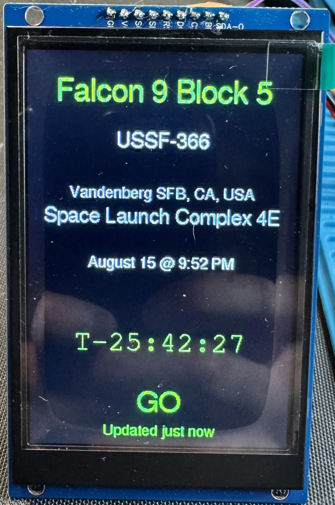

- rocket
- mission name
- launch site
- pad
- scheduled date/time
- countdown timer
- launch status such as GO, HOLD, DELAYED, SCRUBBED, LAUNCHED, or RUD

### Startup and setup states

- If Wi-Fi is not configured yet, the device starts a setup portal named `LaunchDisplay-Setup`
- The TFT shows a QR-based setup screen during initial onboarding
- If no launch data is available yet, the display shows a standby or waiting screen
- If live fetching fails, the screen switches to an error view instead of pretending the data is current

## Getting Started

### 1. Flash the firmware

Build and flash the project with PlatformIO.

### 2. Power the device

On first boot, LaunchDisplay will try to join the saved Wi-Fi.

### 3. If Wi-Fi is not saved

The device creates a setup access point:

- SSID: `LaunchDisplay-Setup`

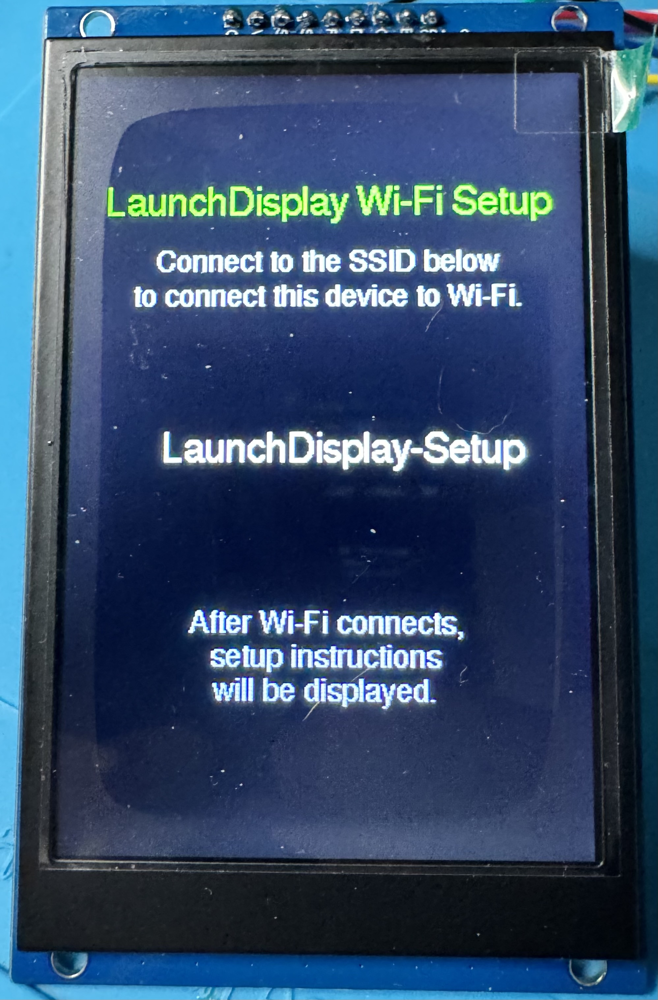

- Once connected to the setup SSID, on most devices the wifi setup screen will appear on a captive portal screen. If this does not happen on your device, open a connection to http://192.168.4.1. 

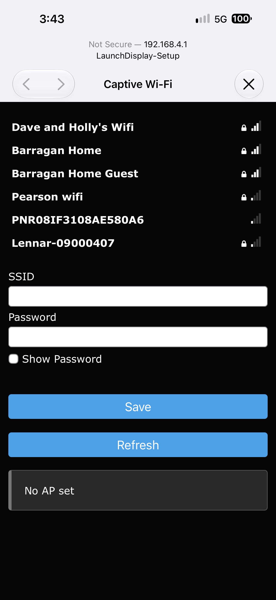

- Select the wifi SSID you wish to connect to and enter the pre-shared key for that network. 

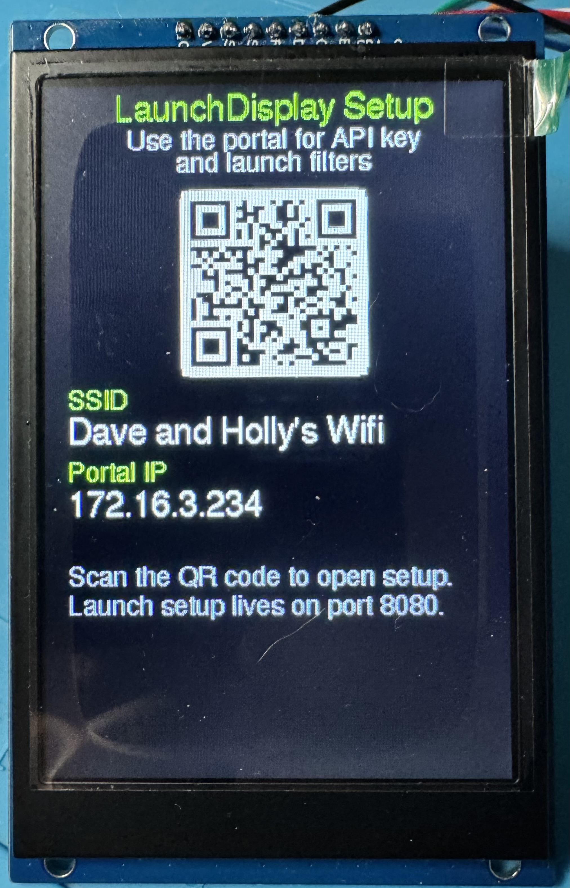

- After the device has successfully connected to wifi, the initial setup screen is displayed. You can either scan the QR code or manually open a http connection on port 8080 to the IP address displayed on the screen to navigate to the setup portal. For example, in the pic above you would go to http://172.16.3.234:8080

### 4. Open the web setup pages

If you scan the QR code during the initial setup, you should go directly to the setup page. However, if you bookmark the setup page, you can always come back to it for access to the following options:

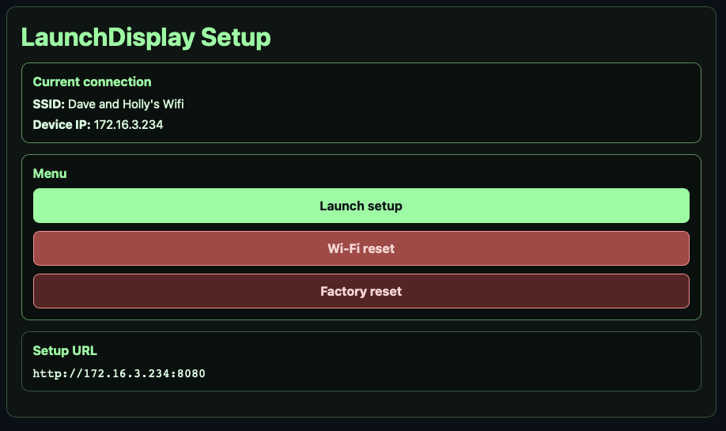

- Settings
- Wi-Fi reset
- Factory reset

## Setup Pages

The main menu is served from the device on port `8080`.

The launch settings page is where you configure everything about what LaunchDisplay should follow and how it should behave.

## Setup Options

### API access

LaunchDisplay defaults to the free version of The Space Devs API. 

Users that have a paid membership to The Space Devs should click the box for "I have a paid Space Devs membership" to access the following additional settings:

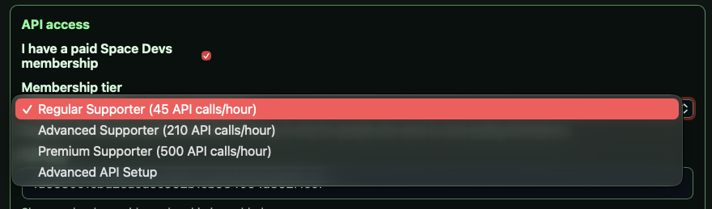

| Setting | What it does | Notes |
| --- | --- | --- |
| I have a paid Space Devs membership | Enables the paid-account path | Leave unchecked for free tier use |
| Membership tier | Chooses the paid polling model | Regular Supporter, Advanced Supporter, Premium Supporter, or Advanced API Setup |
| API key | Space Devs API key | Required for paid membership modes |

### Manually specifying polling frequency

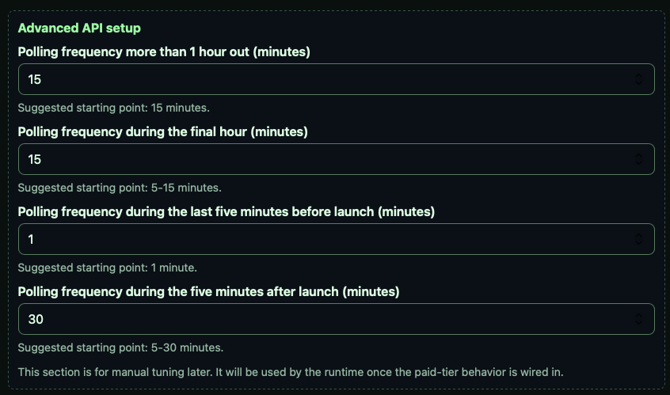

These fields appear when you choose `Advanced API Setup`:

| Setting | What it does | Notes |
| --- | --- | --- |
| Polling frequency more than 1 hour out (minutes) | Poll interval far from launch | Suggested starting point: 15 |
| Polling frequency during the final hour (minutes) | Poll interval closer to launch | Suggested starting point: 5-15 |
| Polling frequency during the last five minutes before launch (minutes) | Final pre-launch polling interval | Suggested starting point: 1 |
| Polling frequency during the five minutes after launch (minutes) | Early post-launch polling interval | Suggested starting point: 5-30 |

### Launch scope

| Setting | What it does | Notes |
| --- | --- | --- |
| Launch scope | Chooses the scope filter | Within a distance, Country, or Worldwide |
| Worldwide (default value) | Shows all schedule launches | No filters applied |
| Country | Filters launches by country | Used only when Launch scope is Country |
| LaunchDisplay Location | Reference location for distance-based scope | Use a city or place name, not a street address or coordinates |
| Distance units | Miles or kilometers | Used only when Launch scope is Within a distance |
| Distance | Distance from the specified location | Used only when Launch scope is Within a distance |

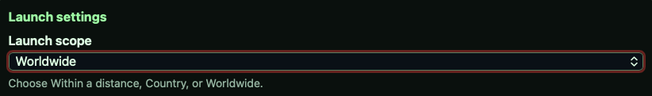

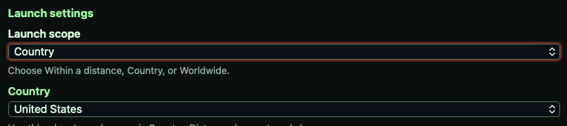

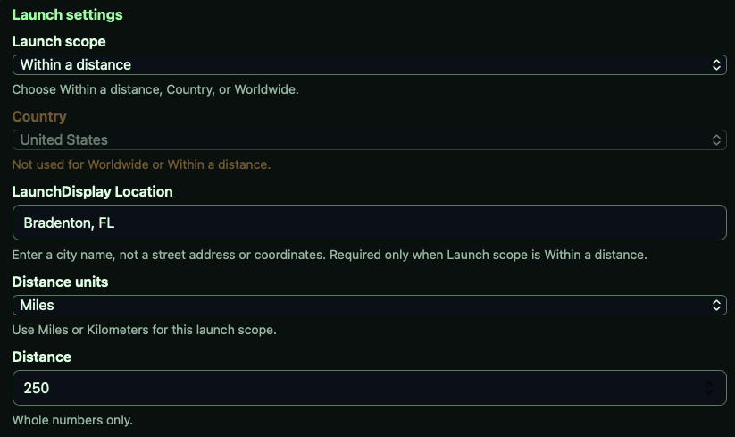

### Time and schedule

| Setting | What it does | Notes |
| --- | --- | --- |
| Time Zone | Display timezone | Used for launch time formatting and countdown behavior |
| Post-launch rollover | How long to keep showing T+ after launch | 15 minutes, 30 minutes, 1 hour, or 2 hours |

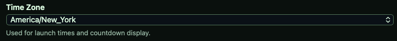

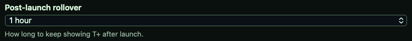

### Sleep schedule

| Setting | What it does | Notes |
| --- | --- | --- |
| Enable schedule | Turns scheduled sleep on or off | When enabled, the TFT sleeps during the chosen window |
| Sleep starts | Sleep start time | Time picker |
| Sleep ends | Sleep end time | Time picker |

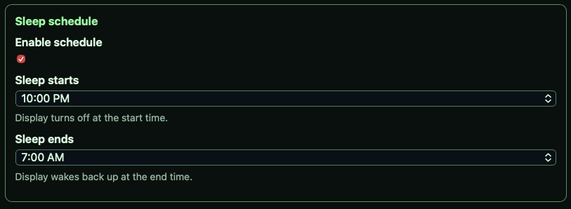

## Polling Behavior

LaunchDisplay intentionally changes how often it polls depending on how close the launch is.

The goal is to:

- stay within the account tier limits
- poll more often when launch time is near
- back off after launch
- avoid hammering the API with unnecessary requests

If the API returns a rate-limit or transient network error, the device backs off and tries again later.

## Launch Data

LaunchDisplay uses Space Devs Launch Library data to determine the next launch.

The display is built around the idea that the data on-screen should be authoritative:

- scheduled launch time comes from the API
- T-minus counts down to that launch time
- after launch, the device can show T+ for a configurable rollover period
- if a launch later changes to HOLD, DELAYED, SCRUBBED, or RUD, the screen should reflect that instead of pretending the launch happened

## Troubleshooting

### The SSID does not appear

- Make sure the ESP32 is powered and booting
- Check the serial console for the Wi-Fi setup portal message
- If you recently changed Wi-Fi settings, confirm the device restarted cleanly

### The setup page keeps coming back

- Check whether the device is still unconfigured
- Verify that Wi-Fi settings were saved successfully
- Clear browser autofill or try a private window if the browser is restoring old form state

### The display is blank or inverted

- Re-check the TFT wiring against the wiring table
- Confirm the backlight pin is connected correctly
- Verify that the display type in `include/DisplayConfig.h` matches the actual panel

### The screen shows a fetch error

- Check Wi-Fi
- Check the API key if you are on a paid tier
- Watch for rate-limit messages in the serial log
- If the API is temporarily overloaded or rate-limited, wait and try again

### The countdown looks wrong

- Confirm the timezone setting
- Confirm the launch scope
- Confirm that the launch data being shown is the correct filtered result for your location and account tier

## Development Notes

- Settings are stored on-device and do not require reflashing for normal configuration changes
- The display and web setup are intentionally separated so launch selection can be changed without touching the firmware
- The firmware keeps a simple appliance-style workflow: flash once, configure from the browser, then use it like a product

## License

MIT

## Roadmap

I will be shipping a completed system to a friend of mine, who will be designing the 3D printed case for LaunchDisplay. Once his work is complete, those file(s) will be included on this repository. 

Keep in mind that not all ESP32's are the same dimensions as the one I used, so you will most likely need to adjust things to hold your ESP32 properly. 
